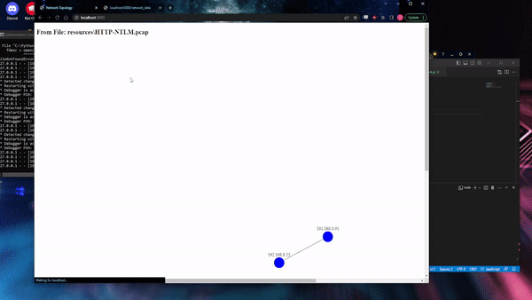

# NETMAP
Network Exploration and Topology MAPping (NETMAP) is a tool that provides visualizations of network packet data captured through pcap files. The application is built using Flask for backend and D3.js for front-end visualization. The visualization represents the Layer 3 connections with nodes representing the IP addresses and lines indicating the connections between them.

## Quick Start
### API
1. Install the required Python packages:
    ```
    pip install scapy flask flask-cors
    ```
2. Run the Flask application:
    ```
    python3 app.py
    ```

### Web UI
1. Install the required Node.js packages:
    ```
    npm install express d3
    ```
2. Run the server:
    ```
    node server.js
    ```

The network data API is hosted at: http://localhost:5000/network_data  
The visualization is hosted at: http://localhost:3000

## Usage  


## Requirements
### Python
- scapy: `pip install scapy`
- flask: `pip install flask`
- flask-cors: `pip install -U flask-cors` (To fix API being able to talk - Cross-Origin Resource Sharing)

### Javascript
- d3: `npm install express d3`
- node: `npm install node`

### Binaries
- Npcap: [https://nmap.org/npcap/](https://nmap.org/npcap/)

## Project Files
The project comprises of the following main files:
- `app.py`: This is the Flask application file that serves network packet data via a REST API. It reads pcap files, and parses the packet data into a JSON format that can be consumed by the client. It also provides a route to download the network data as CSV.

- `network.js`: This file contains the D3.js code that generates the network topology visualization. It fetches data from the Flask API, processes it and uses D3.js to create an interactive network diagram. The diagram can be zoomed and panned, and nodes can be clicked and dragged around.

## Future Work
The main view will be simplified as per the paper: [https://apps.dtic.mil/sti/pdfs/AD1021455.pdf](https://apps.dtic.mil/sti/pdfs/AD1021455.pdf) to focus on the main connections, and to allow the user to draw their own conclusions rather than baking them into the site. The port view has been removed in favor of a more lens/query focused view. Hovering over the lines and nodes provide additional information. A table is also displayed alongside the graphical display, which has filters and sorting capabilities to sift through the information.

In the future, we plan to add a "Scheme of Maneuver modeling" feature, which is a significantly different tool, but still tangentially related.